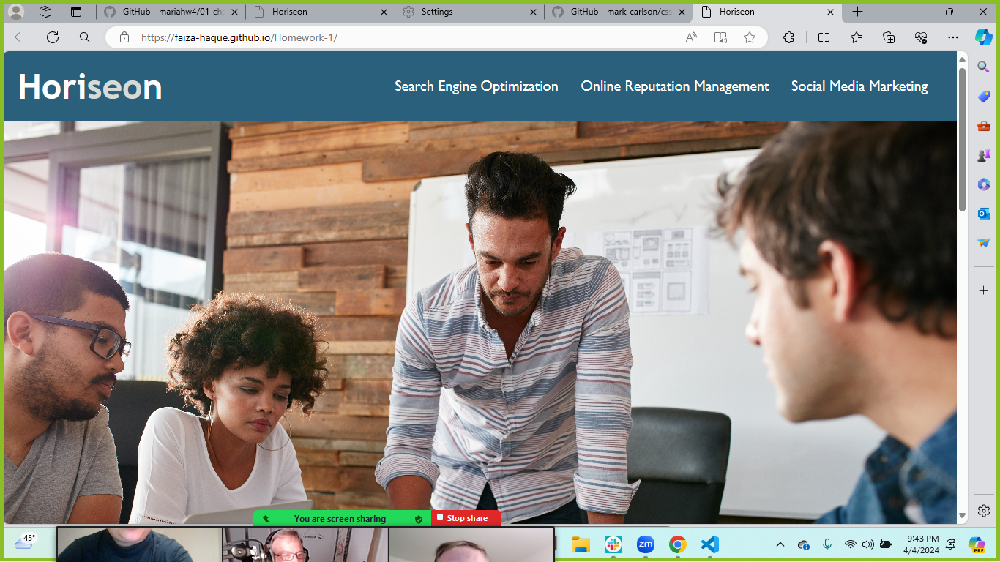

# Homework-1
Challenge 01 - due 04/4/24 Completed by Faiza Haque for UCB Extension Coding Bootcamp

**Refactoring** existing code (improving it without changing what it does) to meet a certain set of standards or to implement a new technology is a common task for front-end and junior developers. For this particular Challenge, a marketing agency has hired you to refactor an existing site to make it more accessible. 

## Deployed Link
[deployed link](https://faiza-haque.github.io/Homework-1/)

## Screenshot of Project

# User Story (as given in Source Material for this Project)
AS A marketing agency
I WANT a codebase that follows accessibility standards
SO THAT our own site is optimized for search engines

## Acceptance Criteria (as given in Source Material for this Project)
GIVEN a webpage meets accessibility standards
WHEN I view the source code
THEN I find semantic HTML elements
WHEN I view the structure of the HTML elements
THEN I find that the elements follow a logical structure independent of styling and positioning
WHEN I view the icon and image elements
THEN I find accessible alt attributes
WHEN I view the heading attributes
THEN they fall in sequential order
WHEN I view the title element
THEN I find a concise, descriptive title
